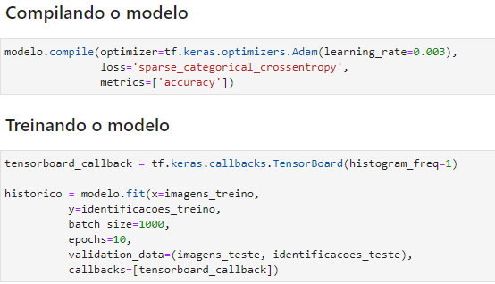
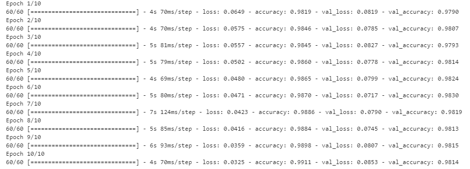
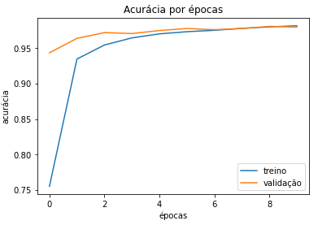
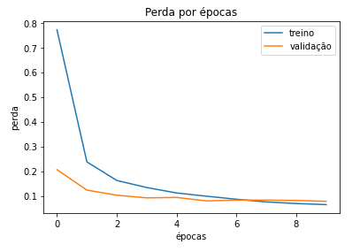

# Avaliação Sprint 3 - Programa de Bolsas Compass.uol e universidades de Rio Grande e Pelotas
Avaliação da terceira sprint do programa de bolsas Compass.uol para formação em chatbot Rasa.

----

### GRUPO:
#### [Anderson Oliveira](https://github.com/andersonaoliveira)
#### [Fernando Barbosa](https://github.com/ofernandobarbosa)
#### [Vinicius Telles](https://github.com/VTellesRg)

----
### DATASET ESCOLHIDO:

#### [MNIST 0️⃣1️⃣2️⃣3️⃣4️⃣5️⃣6️⃣7️⃣8️⃣9️⃣](https://www.tensorflow.org/datasets/catalog/mnist)
----

### LINK PARA TESTAR A APLICAÇÃO
* [Jupter Notebook](https://jupyter-lab-ofernandobarbosa.cloud.okteto.net/lab/workspaces/auto-O?reset)
* Token de acesso -> okteto

----
### SOBRE O DATASET ESCOLHIDO:
O banco de dados [MNIST](https://www.tensorflow.org/datasets/catalog/mnist) possui 70 mil imagens manuscritas de digitos de 0 a 9, que foram normalizadas e centralizadas em um quadrado de tamanho 28 x 28 pixels. Cada imagem é um array de números de pontos flutuantes, representados em uma escala de cinza de 0 (preto) à 1 (branco).
####
----
### TREINAMENTO:
No fit do modelo, foi utilizado o artifício de normalização do modelo com o aumento do 'batch_size', auxiliando na redução do tempo de treinamento do modelo.

Nas 'epochs' utilizamos o valor 10, pois ao treinar outros modelos, percebemos um overfiting entre a validação e o treino, ou seja, a partir do momento em que a acurácia do treino atingir métricas maiores que a acurácia de validação, o treino é considerado dispensável, podemos considerar então o treino como viciado.

####
----
### CÓDIGO:
Código detalhado dentro do [Jupyter Notebook 💻](/mnist.ipynb) 
####
----
### MONGODB:

####
----
### IMAGENS PARA TESTE:
As imagens para teste foram criadas manualmente via paint com lápis espessura 2, foram salvas, normalizadas e centralizadas em tamanhos variados.
####
----
### CONSIDERAÇÕES FINAIS:
#### Dificuldades encontradas

#### Soluções encontradas
####
----
